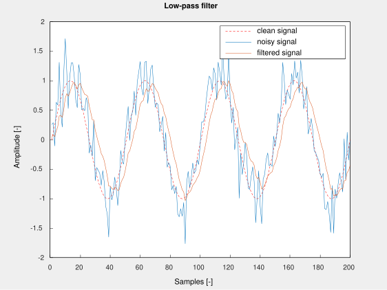
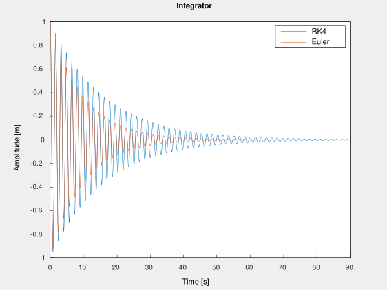
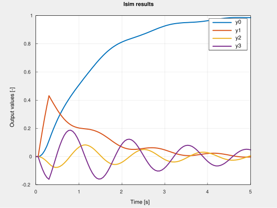
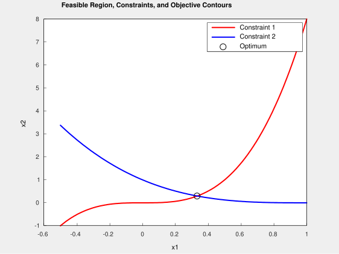

# cpp-engineering-sandbox

[](https://github.com/obrusvit/cpp-engineering-sandbox/actions/workflows/ci.yml)
[](https://codecov.io/gh/obrusvit/cpp-engineering-sandbox)
[](https://github.com/obrusvit/cpp-engineering-sandbox/actions/workflows/codeql-analysis.yml)

## About cpp-engineering-sandbox
C++20 starter repo for numerical engineering with pre-configured libraries and examples of mathematical, physical, and optimization problems.

## Libraries

CPM is used to handle the following libraries. See [`Dependencies.cmake`](./Dependencies.cmake).

- **[Eigen](https://eigen.tuxfamily.org/index.php?title=Main_Page)** - Vector and Matrix types and algorithms.

- **[units](https://github.com/nholthaus/units)** - Type system for physical units with automatic conversion and compile-time dimensionality checking.

- **[NLOpt](https://github.com/stevengj/nlopt)** - Optimization library for nonlinear programs.

- **[Matplot++](https://github.com/alandefreitas/matplotplusplus)** - Simple plotting library (requires gnuplot).

- **[spdlog](https://github.com/gabime/spdlog)** - Logging library.

- **[CLI11](https://github.com/CLIUtils/CLI11)** - Command line args parsing.

- **[catch2](https://github.com/catchorg/Catch2)** - Unit tests.

## Build instructions

```shell
cmake -B build
cmake --build build/
./build/src/<chosen_example>
```

## Examples

### 1) Low-pass filtering of a noisy signal



### 2) System of linear equations

Solving a system of 3 linear equations and plotting their respective planes. Solution is calculated using three distinct numeric methods: least-squares, QR decomposition, LU decomposition.


### 3) Physical simulation of a pendulum

Oscillating pendulum simulated using 4th order Runge-Kutta method (RK4) and a simple 1st order Euler method. Additional physical units are defined for the purpose of the example.



### 4) Simulating a discrete-time linear system

This example implements what is known as `lsim` in Matlab and other similar tools. The code progresses a discretized state space model of a cartpole system.



### 5) Optimization problem

This example shows how to setup a nonlinear optimization problem with nonlinear constraints and bounds constraints. Taken from [NLopt tutorial](https://nlopt.readthedocs.io/en/latest/NLopt_Tutorial/)




## More Details

 * [Dependency Setup](README_dependencies.md)
 * [Building Details](README_building.md)
 * [Troubleshooting](README_troubleshooting.md)
 * [Docker](README_docker.md)
